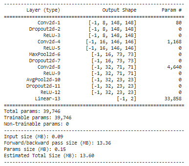

# 50.039-Deep-Learning
For Module 50.039

Students:

- Ong Xiang Qian - 1002646
- Glenn Chia Jin Wee - 1003118

# 1. Table of contents <a name="TOC"></a>

1. [Table of contents](#TOC)
2. [Directory structure](#DS)
3. [Final files and instructions on running them](#INSTRUCTIONS)
4. [Data analysis](#DA)
5. [Proposed model and design](#MODEL)
6. [Model Summary](#MODEL2)
7. [Evaluation of results](#EVAL)
8. [Challenges of predicting covid and non-covid](#CHALLENGE)
9. [Critically evaluating desired model](#OVERALL)
10. [How doctors evaluate covid](#DOCTORS)
11. [References](#REF)

# 2. Directory structure <a name="DS"></a>

```
- notebooks
  |_ colab
    |_ boilerplate
      |_ custom_dataset_dataloader_cascade.ipynb
      |_ custom_dataset_dataloader.ipynb
    |_ experiments
    |_ final
  |_ references
    |_ custom_dataset_dataloader_demo.ipynb
- instructions # contains the small project instructions 
  |_ Small_Project_instructions.pdf
README.md # contains the overview of the project and explanations for the different requirements
```

# 3. Final files and instructions on running them <a name="INSTRUCTIONS"></a>

## 3.1 Training the final model

To train the final model from scratch, simply follow the steps provided below:

Step 1. Move to the folder

```shell
cd notebooks/colab/final
```

Step 2. Open binary_classifier_model.ipynb in Jupyter Notebook

Step 3. Run every cells **EXCEPT** for category 8.2.1

## 3.2 Loading and testing the trained model

The pre-trained weights are stored in the same folder as the final model. Follow the steps to recreate the testing model.

Step 1. Move to the folder

```shell
cd notebooks/colab/final
```

Step 2. Open binary_classifier_model.ipynb in Jupyter Notebook

Step 3. Run every cells **EXCEPT** for category 8.1.1, 8.2.1, 9.1 and 9.2


# 4. Data analysis <a name="DA"></a>

## 4.1 Custom Datasets and Dataloader

The custom dataset requires two core methods to work: __len__ and __getitem__. For __len__ method, it simply returns the total size of the datasets. As for __getitem__, it will match the index provided to the size of each classes in the dataset and tweak the path and final index to retrieve the image from the targeted folder.

### 4.1.1 Binary cascade problem

The dataset class in the binary cascade problem is split into 2 separate classes, L0_Lung_Dataset and L1_Lung_Dataset. The L0_Lung_Dataset class is used to provide images and labels of normal vs infected datasets. L1_Lung_Dataset on the other hand is used to provide images and labels of infected COVID and infected non-COVID. 

### 4.1.2 Three-class problem

For the three-class dataset, it is much simpler. The Lung_Dataset class is used to provide images and labels for normal, infected COVID and infected non-COVID. 

## 4.2 Distribution of data among classes and analysis

<u>**Discuss whether or not the dataset is balanced between classes, uniformly distributed, etc.**</u>

**Training set**

The train data for the different classes are imbalanced. From the graph plotted below, the `infected_non_covid` class has significantly more data points than the other classes. Overall, the ratio `normal:infected_covid:infected_non_covid` is approximately `1:1:2`.

This could present more complications if the model is trained in a stacking manner by first training normal vs infected. The ratio of `normal:infected` would be a ratio of `1:3` which is more imbalanced. However, if there are distinct differences in the data of the normal and infected then this large difference could be negated. Alternatively, data augmentation techniques could be used to increase the size of the training data for the `normal` class. Another possible workaround is to adjust the weights assigned to the different classes in the loss function.

**Testing set**

The test set is also slightly imbalanced with the ratio `normal:infected_covid:infected_non_covid` being approximately `2:1:2`. However, this is not as bad as an imbalanced training set because the test set will not only be used to get a gauge of the model's performance after each epoch and will not directly affect the model's parameter tuning.

**Validation set**

The val set is uniformly distributed between the three classes. However, it is glaring that there are only 8 validation samples for the 3 classes. However, this is acceptable as it is used only for validation and will not affect the model's parameter tuning.

<u>**Overall class distribution**</u>


<u>**Distribution for Layer 0 of the 2 binary classifier approach - normal vs infected**</u>

The graph below gives a Clearer idea about the training imbalance where the ratio of `normal:infected` would be a ratio of `1:3` which are the ratios used when training the binary classifier for Layer 0.


<u>**Distribution for Layer 1 of the 2 binary classifier approach - covid vs non_covid**</u>

The class distribution for infected_covid vs infected_non_covid is imbalanced by about 1:2. This represents what is likely in reality. Covid is new and will probably not have as many data samples as the common infected non-covid X rays. Again, possible data augmentations techniques like mirroring could potentially be used to increase the number of training samples for covid.


## 4.3 Why normalize the data

To recap the normalization can be found in the `Lung_Dataset` class' `open_img` function which did the following normalization.

```python
# Convert to Numpy array and normalize pixel values by dividing by 255.
im = np.asarray(Image.open(f))/255
```

Images have RGB ranges from 0-255. Considering various activation functions like `sigmoid` such a large range would mean that for vastly different values like 100 and 255, not much difference can be seen when passed into the `sigmoid` activation function. Both would produce a value that is close to 1.

Taking the same values as reference, if we divide by 255, for a value of 100,  $\frac{100}{255}$ we get approximately 0.39. Then for a value of 255, $\frac{255}{255}$ we get 1. For the initial value of 100 that becomes 0.39 after the division, passing it into `sigmoid(0.39)` produces a value of 0.596. Meanwhile for the initial value of 255 that becomes 1 after division, passing it into `sigmoid(1)` produces a value of 0.731. This difference in value allows us to extract meaningful differences in the pixel values.

## 4.4 Other potential pre-processing operations

Form the plot below, which is based on the Training set for normal images as reference, it is evident that there are several differences in the photo dimensions and photo environment. 


For example, comparing image_index 1 and image_index 28 there is a clear difference in the lighting, Image_index 28 is a lot brighter. One pre-processing step could be to use histogram normalization. There is a paper that recommends 14 possible normalization algorithms that can be performed (Leszczynski, 2010).

Another example is comparing "skinny" images like image_index 1 and image_index 31 where there is significantly more dark backgrounds at the side compares to images like image_index 12. Perhaps a edge detection algorithm can be applied to just filter the relevant parts of the image which are the lungs.

## 4.5 Possible data augmentations

Reference link on how Doctors diagnose Covid-19: [The role of chest radiography in confirming covid-19 pneumonia](https://www.bmj.com/content/370/bmj.m2426#:~:text=Most%20people%20with%20covid%2D19,those%20with%20covid%2D19%20pneumonia.)

Relevant insight:

- "covid-19 pneumonia changes are mostly **bilateral on chest radiographs** (72.9%, 95% confidence interval 58.6 to 87.1) and have **ground glass opacity** in 68.5% of cases (95% CI 51.8 to 85.2)"
- The paper provides several images and analyzes them. From the images, it seems that the target areas are in the 4 corners of the lungs, perhaps data augmentation can perform crops to those areas

How it can be used in the model?

- Problem: The data classes are imbalanced for covid and non-covid and that the model has more problems differentiating the 2 compared to differentiating normal and infected.
  Solution: Since covid-19 is `bilateral` meaning that it affects both sides of the lungs at a high probability. Perhaps mirroring images could be a possible approach to increase the size of the dataset for covid images, giving the model a more balanced dataset and more covid images to recognize

# 5. Proposed model <a name="MODEL"></a>

## 5.1 3-class classifier vs 2 binary classifiers

**<u>Differences between the 2 architectures</u>**

The first architecture is built on top of two binary classifiers. In this project, the top layer will classify normal vs infected x-rays and subsequent layer will classify COVID vs non-COVID x-rays. This approach is advantageous as each models are able to learn distinct features that are catered towards their primary target. At the same time, each model is able to fully utilize the complementary datasets (e.g. infected COVID and infected non-COVID can be considered as infected) which could improve the accuracy of the models. 

The seconds architecture is a three class classifier. It classifies the x-rays according to normal, infected COVID and infected non-COVID cases. With this architecture, the overall classification is reliant on only one model which reduces the training time and tuning parameters. 

**<u>Why we chose the 2 binary classifier approach</u>**

## 5.2 2 Binary classifiers architecture design
As the number of dataset is generally low, using the first architecture, 2 binary classifier, would allow us to tap onto complementary datasets to train each of the models. Furthermore, having two layers will allow the flexibility to tune individual hyperparameter to improve the overall accuracy for that specific model.

On the hindsight, it is unclear if the architecture is truly the best option to take. As such, we will be doing an exploratory analysis using both models and evaluating their effectiveness. 

## 5.2 2 2 Binary classifiers architecture design
### 5.2.1 Referencing literature and traditional well-performing models

Methodology

- There are many possible models to select from. To simplify the model selection process, we reference literature that propose novel architectures that solved similar problems.
- To benchmark the custom models, we also experimented using the naïve single convolution model provided in the starter notebook
- For a more robust benchmark, we modified the resnet architecture, using only a single layer of resnet for the experiments. The rationale was that the dataset was rather small and having too many layers would probably not work as well as they will likely overfit on the training data and this eventually results in poor performance for the Validation data. We chose resnet because it has generally performed well on image classification problems. For example, a paper by Talo, M. uses resnet's [Convolutional Neural Networks for Multi-class Histopathology Image Classification](https://arxiv.org/ftp/arxiv/papers/1903/1903.10035.pdf) and has achieved decent performance for the metrics they chose
- Finally, the custom network chosen was based of the paper [COVINet: a convolutional neural network approach for predicting COVID-19 from chest X-ray images](https://link.springer.com/article/10.1007/s12652-021-02917-3#Sec9). The model proposed was tested on different number of classes, and has achieved a high accuracy.
- To test the performance of these models, we use defaults for the optimizer, learning rate. The only parameter that we adjust is the number of epochs, based on trial and error. This meant running the models on a large number of epochs and eventually selecting the best epoch number for each model.

<u>**Naïve single convolution model**</u>

The naïve single convolution model was the model provided in the starter notebook. The notebook for this experiment can be found at `./notebooks/colab/experiments/binary_selection/naive_classifier.ipynb`. After initially experimenting using a large number of epochs, the first classifier uses 3 epochs and the second classifier uses 4 epochs before they overfit.


Result:

Accuracy: 14/24 (58.3%)

Confusion matrix:


|           | Normal | Covid | Non-covid |
| --------- | ------ | ----- | --------- |
| Recall    | 0.62   | 0.87  | 0.25      |
| Precision | 1.00   | 0.46  | 0.50      |
| f1_score  | 0.76   | 0.60  | 0.33      |

The results for loss and accuracy on the train and test set during training can be found at

- `./results/experiments/binary_selection/naive_binary_L0_net.txt`
- `./results/experiments/binary_selection/naive_binary_L1_net.txt`

**<u>Re-implementing a scaled down version of resnet</u>**

The architecture for this model was motivated by resnet. In terms of number of channels, kernel size, stride and padding, the single layer mimics the resnet architecture. A single layer was chosen because the dataset provided is small and a full resnet implementation will likely overfit on the data. The notebook for this experiment can be found at `./notebooks/colab/experiments/binary_selection/resnet_classifier.ipynb`. The model was implemented by hand and trained from scratch.


Result: 15/24 (62.5%)

Accuracy on validation set: 

Confusion matrix


Relevant metrics on validation set:

|           | Normal | Covid | Non-covid |
| --------- | ------ | ----- | --------- |
| Recall    | 0.75   | 1.00  | 0.12      |
| Precision | 0.85   | 0.50  | 1.00      |
| f1_score  | 0.79   | 0.66  | 0.22      |

The results for loss and accuracy on the train and test set during training can be found at

- `./results/experiments/binary_selection/simple_resnet_L0_net.txt`
- `./results/experiments/binary_selection/simple_resnet_L1_net.txt`

<u>**Models from literature that tackled similar problems - COVINet**</u>

The architecture for this model was motivated from the following paper: [COVINet: a convolutional neural network approach for predicting COVID-19 from chest X-ray images](https://link.springer.com/article/10.1007/s12652-021-02917-3#Sec9). This model performed the best among the models. From the architecture, it is around the same complexity as the modified resnet but it has more layers than the naïve classifier. The increase in number of convolution layers means that lower layers can learn lower level features and subsequent layers the higher level features. Dropout layers at different parts of the architecture also help to reduce overfitting. The notebook for this experiment can be found at `./notebooks/colab/experiments/binary_selection/COVINet_classifier.ipynb`. The model was implemented by hand and trained from scratch. A slight tweak was made to model 2 to add a stride of size 2 to the max pooling layer. This was found to improve the model's performance significantly.



Result:

Accuracy on validation set: 16/24 (66.7%)

Confusion matrix


Relevant metrics on validation set:

|           | Normal | Covid | Non-covid |
| --------- | ------ | ----- | --------- |
| Recall    | 0.62   | 1.00  | 0.375     |
| Precision | 1.00   | 0.57  | 0.60      |
| f1_score  | 0.76   | 0.72  | 0.46      |

The results for loss and accuracy on the train and test set during training can be found at

- `./results/experiments/binary_selection/COVINet_L0_net.txt`
- `./results/experiments/binary_selection/COVINet_L1_net.txt`

**<u>Conclusion</u>**

Overall it is evident that the custom COVIN model that was specifically designed for this type of problem performs better than the other 2 baselines. The better performance can be seen in most metrics used such as recall, precision, and accuracy. In the context, of Covid, the important metrics to consider would be the Recall and Precision scores for Covid. Both of these metrics are better than the other models. Moving forward, we will tune the parameters for COVINet.

### 5.2.2 Model parameters

The architecture was motivated by the following paper: [COVINet: a convolutional neural network approach for predicting COVID-19 from chest X-ray images](https://link.springer.com/article/10.1007/s12652-021-02917-3#Sec9). This section seeks to understand the choice of layers and parameters chosen by this paper. To recap, the model is as follows:


**<u>Convolution layers</u>**

One of the approaches to designing Convolution layers is to stack convolution layers as mentioned in class. The initial convolution layers will learn the low level features of the images. Subsequent layers can interpret these extracted features and could have a deeper feature representation.

The original model proposed by the paper uses 1->16->128->256 transitions between convolution layers. This has a large number of parameters which makes sense for their problem because their dataset consists of 10,000 images. In this problem, the dataset we are using only has about 5854 images. Hence, having a smaller output size and thus lesser parameters would likely reduce the likelihood of overfitting.

**<u>Dropout layers</u>**

Dropout means that at training time, we randomly set 1-p of all neurons to 0. This is a way of adding noise to the learning problem. For instance, if there is a certain pattern that consistently occurs in the training data but not in any other dataset, then setting the neurons that identify this pattern to 0 will allow the model to forget these training set specific patterns. This can help to model to generalize better to reduce the likelihood of overfitting.

**<u>Relu layers</u>**

Relu layers help to overcome the vanishing gradient problem. Relu ouputs a true 0 value for values <= 0. This true 0 values are known as a spare representation and can help speed up learning and simplify the model. For values >0, they are output in a  linear fashion. Gradients thus remain proportional to node activations and help to prevent vanishing gradients.

**<u>Pooling layers</u>**


**<u>Linear layers</u>**

The last linear layer simply outputs a tensor with shape [1 2] corresponding to the probability of a data point being classified as either of the 2 classes.

### 5.2.3 Mini-batch size

Advantage of using a batch size

- Reduce computations since the mean and variance of the whole training set does not have to be computed. This speeds up training.
- Batch normalization also means that the gradient with respect to the inputs does not depend on the scale of the weights

Some considerations is that batch size should not be below 8 because then the mean and variance will not be stable.

At the same time, the link at https://stats.stackexchange.com/questions/164876/what-is-the-trade-off-between-batch-size-and-number-of-iterations-to-train-a-neu suggests the pitfalls of having a batch size that is too large. If the batch size is too large, this could degrade the model's ability to generalize as they converge to "sharp minimizers of the training and testing functions"

**<u>Recommendations</u>**

Reference links

- https://ai.stackexchange.com/questions/8560/how-do-i-choose-the-optimal-batch-size
- https://stats.stackexchange.com/questions/164876/what-is-the-trade-off-between-batch-size-and-number-of-iterations-to-train-a-neu

The general rule of thumb for batch size would be `32, 64, 128`

Since the dataset is small, we will experiment with `16,32,64`

- 32 was already done in the pervious section

<u>**Batch size of 16:**</u>

Result:

Accuracy on validation set: 16/24 (66.7%)

Confusion matrix


Relevant metrics on validation set:

|           | Normal | Covid | Non-covid |
| --------- | ------ | ----- | --------- |
| Recall    | 0.87   | 0.75  | 0.375     |
| Precision | 0.87   | 0.60  | 0.50      |
| f1_score  | 0.87   | 0.66  | 0.42      |

The results for loss and accuracy on the train and test set during training can be found at

- `./results/experiments/batch_size/COVINet_L0_net_16.txt`
- `./results/experiments/batch_size/COVINet_L1_net_16.txt`

<u>**Batch size of 64:**</u>

Result:

Accuracy on validation set: 12/24 (50.0%)

Confusion matrix


Relevant metrics on validation set:

|           | Normal | Covid | Non-covid |
| --------- | ------ | ----- | --------- |
| Recall    | 0.50   | 0.62  | 0.37      |
| Precision | 1.00   | 0.45  | 0.33      |
| f1_score  | 0.66   | 0.52  | 0.35      |

The results for loss and accuracy on the train and test set during training can be found at

- `./results/experiments/batch_size/COVINet_L0_net_64.txt`
- `./results/experiments/batch_size/COVINet_L1_net_64.txt`

### 5.2.4 Loss function

<u>**Why cross-entropy loss?**</u>

We used cross-entropy loss when we were experimenting with the 3 class classifier as cross entropy loss is ideal for multi-class networks. We decided to thus preserve the code across to the 2 x binary classifier model. Cross entropy loss also allows us to set weights on the different classes to account for their class imbalances. For example, for the first binary classifier for normal:infected, the ratio is about 1:2.88. To account for this, we can set the same ratios using the following line:

```python
l0_class_weights = torch.tensor([2.88, 1.0]).to(torch.device(device))
criterion = nn.CrossEntropyLoss(l0_class_weights)
```

<u>**Experimenting with weighted cross-entropy to account for imbalanced classes**</u>

The ratios of the classes are as follows

- Normal:infected = 1341:3875 = approx 1:2.88
- covid:non_covid = 1345:2530 = approx 1:1.88

For normal:infected, it makes sense to favor the infected case a bit more in predictions since it is safer to misclasify a normal person as an infected person rather than an infected person as a normal person. In the latter case, this is dangerous for the public as that person may spread the infection to other people. Hence, the weights chosen are 2.83:1

For covid:non_covid, we favor covid since covid is more deadly than non_covid infections. Hence, we choose a 1.9:1 ratio for the weighs

While experimenting, the epoch counts were tweaked to ensure optimum performance.

**<u>Results</u>**

Accuracy on validation set: 17/24 (70.8%)

Confusion Matrix:


Relevant metrics on validation set:

|           | Normal | Covid | Non-covid |
| --------- | ------ | ----- | --------- |
| Recall    | 0.87   | 1.0   | 0.25      |
| Precision | 0.87   | 0.57  | 1.00      |
| f1_score  | 0.87   | 0.72  | 0.40      |

The results for loss and accuracy on the train and test set during training can be found at

- `./results/experiments/cross_entropy_weights/COVINet_L0_net.txt`
- `./results/experiments/cross_entropy_weights/COVINet_L1_net.txt`

## 5.3 Optimizer

### 5.3.1 Optimizer selection

<u>**Adam vs AdamW theory**</u>

The core difference between AdamW and Adam is the regularization pattern. For Adam, the weight decay ends up with the moving average while AdamW ensures that the regularization term does not, which make the regularization proportional to the weight itself.

Experimentally, AdamW should yield better training loss and that the models generalize much better than models trained with Adam. 

<u>**Adam vs AdamW empirical**</u>

Log: results/experiments/tuning_layer_0_hyperparameters.log

| Epochs | Learning Rate | Scheduler Gamma | Weight Decay | Optimizer | Accuracy |
| ------ | ------------- | --------------- | ------------ | --------- | -------- |
| 10     | 0.0001        | 0.1             | 0            | Adam      | 0.9468   |
| 10     | 0.0001        | 0.1             | 0            | AdamW     | 0.9413   |

From the table, we can see that with Adam optimizer, the accuracy is slightly higher than AdamW. However, this might be affected by the Dataloader random shuffle. Since the difference is small, we would pick AdamW as the optimizer. 

### 5.3.2 Regularization - Weight Decay

The weight decay parameter is use as a L2 regularization in the Adam optimizer. L2 regularization is used to alleviate overfitting of the model. 

Log: results/experiments/tuning_layer_0_hyperparameters.log

| Epochs | Learning Rate | Scheduler Gamma | Weight Decay | Optimizer | Accuracy |
| ------ | ------------- | --------------- | ------------ | --------- | -------- |
| 10     | 0.0001        | 0.1             | 0            | Adam      | 0.9468   |
| 10     | 0.0001        | 0.1             | 0.005        | Adam      | 0.9468   |

With all other hyperparameters equal, it is found that weight decay of 0 has the same accuracy than a weight decay of 0.005. One advantage of having the weight is to prevent overfitting. Since both of the accuracy are roughly the same, we will be using decay weight of 0.005. 

### 5.3.3 Learning rate

**<u>Experimenting with different learning rates</u>**

Log: results/experiments/tuning_layer_0_hyperparameters.log

Log file: layer_0_gridsearch.log

| Epochs | Learning Rate | Scheduler Gamma | Weight Decay | Optimizer | Accuracy |
| ------ | ------------- | --------------- | ------------ | --------- | -------- |
| 10     | 0.00001       | 0.1             | 0            | Adam      | 0.8696   |
| 10     | 0.0001        | 0.1             | 0            | Adam      | 0.9468   |
| 10     | 0.001         | 0.1             | 0            | Adam      | 0.9688   |

From the experiment, we can see that reducing the learning rate by a factor of 10 drastically reduces the overall accuracy. One explanation could be that the reduced learning rate slows down the rate of convergence. This in turn reduces the accuracy of the model at the given epoch while having the same hyperparameters. 

At the same time, we can see that a learning rate of 0.001 has a higher accuracy. However, as we look closer to the training logs, it can be seen that it is overfitting as the training loss increases even when the training accuracy decreases. As such, we will be taking learning rate of 0.0001.

| Epoch | Training Accuracy | Test Loss |
| ----- | ----------------- | --------- |
| 1     | 0.8209            | 1.1383    |
| 2     | 0.9201            | 0.8361    |
| 3     | 0.9377            | 0.6164    |
| 4     | 0.9494            | 0.7095    |
| 5     | 0.9553            | 1.0498    |
| 6     | 0.9659            | 1.2475    |
| 7     | 0.9678            | 1.2539    |
| 8     | 0.9657            | 1.2458    |
| 9     | 0.9672            | 1.3407    |
| 10    | 0.9688            | 1.2613    |


### 5.3.4 Scheduled learning rate

Log: results/experiments/tuning_layer_0_hyperparameters.log

Under the hyperparameter folder, we have experimented with the scheduled learning rate to gauge the effectiveness of implementing the scheduler. In the experiment, pytorch's StepLR was used with step size of 5 with variance of gamma of [0.1, 0.001] . The gamma determines the decay of the rate of the learning rate at after every predetermined step size. 

| Epochs | Learning Rate | Scheduler Gamma | Weight Decay | Optimizer | Accuracy |
| ------ | ------------- | --------------- | ------------ | --------- | -------- |
| 10     | 0.0001        | 0.1             | 0            | Adam      | 0.9436   |
| 10     | 0.0001        | 0.001           | 0            | Adam      | 0.9346   |

From the table, we can see that there are hardly noticeable change in the accuracy. This could due to the low epoch count that makes the difference inconsequential. As such, we will not be using scheduler for the final model. 

## 5.4 Model parameters

In our final model, we will be using the stated parameter number as provided based on the initial hyperparameter experimentation and **further fine-tuning**.

**Layer 0**

- Number of Epochs: 5
- Learning Rate: 0.0001
- Weight Decay: 0.0005
- Optimizer: AdamW
- Learning Rate Scheduler: None

**Layer 1**

- Number of Epochs : 35
- Learning Rate: 0.0001
- Weight Decay: 0.0005
- Optimizer: AdamW
- Learning Rate Scheduler: None

## 5.5 Implementing checkpoints

Checkpoints are saved at every epoch to ensure that the models can be loaded for evaluation. In the event of crashing midway during training, the checkpoints can provide the state to continue training again.

The Checkpoint stores the following variables:

- Current epochs
- Model state dict
- Optimizer state dict
- training loss
- test loss
- test accuracy
- training accuracy

# 6. Model Summary <a name="MODEL2"></a>

Recapitulation

# 7. Evaluation <a name="EVAL"></a>

## 7.1 Learning curves

Loss vs epochs

Accuracy vs epochs

## 7.2 Key metrics and considerations

<u>**Confusion matrix**</u>

<u>**Recall and precision**</u>

<u>**F1 score**</u>

## 7.3 Accuracy and image diagrams

## 7.4 Investigating failures with feature maps

# 8. Challenges of predictions <a name="CHALLENGE"></a>

## 8.1 Differentiating covid and non-covid

# 9. Overall - what is the better model, accuracy vs low true negatives/false positives rates on certain classes <a name="OVERALL"></a>


# 10. How doctors diagnose infections based on x-rays. <a name="DOCTORS"></a>

Reference link: [How accurate is chest imaging for diagnosing COVID-19?](https://www.cochrane.org/CD013639/INFECTN_how-accurate-chest-imaging-diagnosing-covid-19)

- Defines X-Rays as "X-rays (radiography) use radiation to produce a 2-D image"
- This paper pooled results from several sources (if there were 4 or more results). For Chest X-rays, it found that the Chest X-ray "correctly diagnosed COVID-19 in 80.6% of the people who had COVID-19. However it incorrectly identified COVID-19 in 28.5% of the people who did not have COVID-19"

Critical insight

- It seems that classifications for X-rays have room for improvement, the numbers indicated above would provide a baseline for any model's performance

Citation:

> Islam N, Ebrahimzadeh S, Salameh J-P, Kazi S, Fabiano N, Treanor L, Absi M, Hallgrimson Z, Leeflang MMG, Hooft L, van der Pol CB, Prager R, Hare SS, Dennie C, Spijker R, Deeks JJ, Dinnes J, Jenniskens K, Korevaar DA, Cohen JF, Van den Bruel A, Takwoingi Y, van de Wijgert J, Damen JAAG, Wang J, McInnes MDF, Cochrane COVID-19 Diagnostic Test Accuracy Group. Thoracic imaging tests for the diagnosis of COVID-19. Cochrane Database of Systematic Reviews 2021, Issue 3. Art. No.: CD013639. DOI: 10.1002/14651858.CD013639.pub4.

Reference link 2: [The role of chest radiography in confirming covid-19 pneumonia](https://www.bmj.com/content/370/bmj.m2426#:~:text=Most%20people%20with%20covid%2D19,those%20with%20covid%2D19%20pneumonia.)

- "No single feature of covid-19 pneumonia on a chest radiograph is specific or diagnostic, but a combination of multifocal peripheral lung changes of ground glass opacity and/or consolidation, which are most commonly bilateral, may be present"
- "Diagnosis might be complicated as covid-19 pneumonia may or may not be visible on chest radiograph"
- "Most patients with covid-19 infection have a mild illness and do not develop pneumonia"
- Diagnose
  1. **"Like other pneumonias, covid-19 pneumonia causes the density of the lungs to increase**. This may be seen as **whiteness in the lungs** on radiography which, depending on the severity of the pneumonia, **obscures the lung markings** that are normally seen; however, this may be delayed in appearing or absent."
  2. "Review the radiograph systematically, looking for abnormalities of the **heart, mediastinum, lungs, diaphragm, and ribs**,[9](https://www.bmj.com/content/370/bmj.m2426#ref-9) and remembering that radiographic changes of covid-19 pneumonia can be **subtle or absent**."
  3. "covid-19 pneumonia changes are mostly **bilateral on chest radiographs** (72.9%, 95% confidence interval 58.6 to 87.1) and have **ground glass opacity** in 68.5% of cases (95% CI 51.8 to 85.2)"
  4. "common manifestations and patterns of **lung abnormality** seen on portable chest radiography in covid-19 patients"
- How it can be used in the model?
  1. The paper provides several images and analyzes them. From the images, it seems that the target areas are in the 4 corners of the lungs, perhaps data augmentation can perform crops to those areas
  2. In addition, covid-19 is "bilateral" meaning that it affects both sides of the lungs at a high probability. Perhaps mirroring images could be a possible approach to increase the size of the dataset.

Citation:

```bib
@article {Cleverleym2426,
	author = {Cleverley, Joanne and Piper, James and Jones, Melvyn M},
	title = {The role of chest radiography in confirming covid-19 pneumonia},
	volume = {370},
	elocation-id = {m2426},
	year = {2020},
	doi = {10.1136/bmj.m2426},
	publisher = {BMJ Publishing Group Ltd},
	URL = {https://www.bmj.com/content/370/bmj.m2426},
	eprint = {https://www.bmj.com/content/370/bmj.m2426.full.pdf},
	journal = {BMJ}
}
```

# 11. References <a name="REF"></a>

Leszczynski, M. (2010). Image Preprocessing for Illumination Invariant Face Verification. Journal of telecommunications and information technology, 19-25.

# 12. Common bug fixes

## Bug fix 1

**<u>Issue</u>**

Erroneous Code

```python
train_loss  = criterion(output, y_train_batch)
```

Error: `RuntimeError: 1D target tensor expected, multi-target not supported`

<u>**Background information**</u>

`criterion` is defined as `criterion = nn.CrossEntropyLoss()`

Tensors were initialized as `[1 0 0]` in the dataset class' `__getitem`. This was then passed to the data loader in `train_loader = DataLoader(ld_train, batch_size = bs_val, shuffle = True)` for the respective train, validation, test.

**<u>Explanation</u>**

The following link at [Pytorch discussion - RuntimeError: multi-target not supported](https://discuss.pytorch.org/t/runtimeerror-multi-target-not-supported-newbie/10216/3) explains it

This issue is caused by  because `CrossEntropyLoss` does not expect a one-hot encoded vector as the target, but class indices: The input is expected to contain scores for each class. Input has to be a 2D Tensor of size (minibatch, C). This criterion expects a class index (0 to C-1) as the target for each value of a 1D tensor of size minibatch

Example inputs

```python
loss = nn.CrossEntropyLoss()
# Input: (N, C). C is the number of classes
input = torch.randn(3, 5, requires_grad=True)
'''
tensor([[-0.9296, -0.6807,  0.1294,  0.0215,  1.1662],
        [-2.0247, -1.5964,  1.4188, -1.4765,  0.7276],
        [-0.3432, -2.3248,  0.2816, -0.4983, -0.7904]], requires_grad=True)
'''
target = torch.empty(3, dtype=torch.long).random_(5)
'''
tensor([2, 4, 1])
'''
output = loss(input, target)
'''
tensor(2.1256, grad_fn=<NllLossBackward>)
'''
```

**<u>Fix</u>**

**Possible fix 1:**

This fix was shown in the link. Change the loss to the following:

```python
loss = criterion(outputs, torch.max(y_train_batch, 1)[1])
```

What `torch.max` does. Refer to [PyTorch docs TORCH.MAX](https://pytorch.org/docs/stable/generated/torch.max.html)

```python
for k, v in train_loader:
    print(v)
    '''
    tensor([[0., 1., 0.],
        [1., 0., 0.],
        [0., 1., 0.],
        [0., 1., 0.]])
    '''
    print(torch.max(v))
    '''
    tensor(1.)
    '''
    print(torch.max(v,1))
    '''
    values=tensor([1., 1., 1., 1.]),
    indices=tensor([1, 0, 1, 1]))
    '''
    print(torch.max(v,1)[1])
    '''
    tensor([1, 0, 1, 1]) 
    # this is the index of the max value per sample in the batch
    # example: first sample, the max is at index 1. Hence the first element in the tensor
    indicates that sample 1's max is at index 1
    '''
    # Forced stop
    break
```

