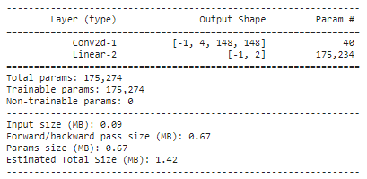
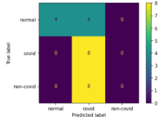
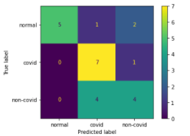

# 50.039-Deep-Learning
For Module 50.039

Students:

- Ong Xiang Qian - 1002646
- Glenn Chia Jin Wee - 1003118

# 1. Table of contents <a name="TOC"></a>

1. [Table of contents](#TOC)
2. [Directory structure](#DS)
3. [Final files and instructions on running them](#INSTRUCTIONS)
4. [Data analysis](#DA)
5. [Proposed model and design](#MODEL)
6. [Model Summary](#MODEL2)
7. [Evaluation of results](#EVAL)
8. [Challenges of predicting covid and non-covid](#CHALLENGE)
9. [Critically evaluating desired model](#OVERALL)
10. [How doctors evaluate covid](#DOCTORS)
11. [References](#REF)

# 2. Directory structure <a name="DS"></a>

```
- notebooks
  |_ colab
    |_ boilerplate
      |_ custom_dataset_dataloader_cascade.ipynb
      |_ custom_dataset_dataloader.ipynb
    |_ experiments
    |_ final
  |_ references
    |_ custom_dataset_dataloader_demo.ipynb
- instructions # contains the small project instructions 
  |_ Small_Project_instructions.pdf
README.md # contains the overview of the project and explanations for the different requirements
```

# 3. Final files and instructions on running them <a name="INSTRUCTIONS"></a>

## 3.1 Training the final model

## 3.2 Loading and testing the trained model

# 4. Data analysis <a name="DA"></a>

## 4.1 Custom Datasets and Dataloader

### 4.1.1 Binary cascade problem

### 4.1.2 Three-class problem

## 4.2 Distribution of data among classes and analysis

<u>**Discuss whether or not the dataset is balanced between classes, uniformly distributed, etc.**</u>

**Training set**

The train data for the different classes are imbalanced. From the graph plotted below, the `infected_non_covid` class has significantly more data points than the other classes. Overall, the ratio `normal:infected_covid:infected_non_covid` is approximately `1:1:2`.

This could present more complications if the model is trained in a stacking manner by first training normal vs infected. The ratio of `normal:infected` would be a ratio of `1:3` which is more imbalanced. However, if there are distinct differences in the data of the normal and infected then this large difference could be negated. Alternatively, data augmentation techniques could be used to increase the size of the training data for the `normal` class. Another possible workaround is to adjust the weights assigned to the different classes in the loss function.

**Testing set**

The test set is also slightly imbalanced with the ratio `normal:infected_covid:infected_non_covid` being approximately `2:1:2`. However, this is not as bad as an imbalanced training set because the test set will not only be used to get a gauge of the model's performance after each epoch and will not directly affect the model's parameter tuning.

**Validation set**

The val set is uniformly distributed between the three classes. However, it is glaring that there are only 8 validation samples for the 3 classes. However, this is acceptable as it is used only for validation and will not affect the model's parameter tuning.

<u>**Overall class distribution**</u>


<u>**Distribution for Layer 0 of the 2 binary classifier approach - normal vs infected**</u>

The graph below gives a Clearer idea about the training imbalance where the ratio of `normal:infected` would be a ratio of `1:3` which are the ratios used when training the binary classifier for Layer 0.


<u>**Distribution for Layer 1 of the 2 binary classifier approach - covid vs non_covid**</u>

The class distribution for infected_covid vs infected_non_covid is imbalanced by about 1:2. This represents what is likely in reality. Covid is new and will probably not have as many data samples as the common infected non-covid X rays. Again, possible data augmentations techniques like mirroring could potentially be used to increase the number of training samples for covid.


## 4.3 Why normalize the data

To recap the normalization can be found in the `Lung_Dataset` class' `open_img` function which did the following normalization.

```python
# Convert to Numpy array and normalize pixel values by dividing by 255.
im = np.asarray(Image.open(f))/255
```

Images have RGB ranges from 0-255. Considering various activation functions like `sigmoid` such a large range would mean that for vastly different values like 100 and 255, not much difference can be seen when passed into the `sigmoid` activation function. Both would produce a value that is close to 1.

Taking the same values as reference, if we divide by 255, for a value of 100,  $\frac{100}{255}$ we get approximately 0.39. Then for a value of 255, $\frac{255}{255}$ we get 1. For the initial value of 100 that becomes 0.39 after the division, passing it into `sigmoid(0.39)` produces a value of 0.596. Meanwhile for the initial value of 255 that becomes 1 after division, passing it into `sigmoid(1)` produces a value of 0.731. This difference in value allows us to extract meaningful differences in the pixel values.

## 4.4 Other potential pre-processing operations

Form the plot below, which is based on the Training set for normal images as reference, it is evident that there are several differences in the photo dimensions and photo environment. 


For example, comparing image_index 1 and image_index 28 there is a clear difference in the lighting, Image_index 28 is a lot brighter. One pre-processing step could be to use histogram normalization. There is a paper that recommends 14 possible normalization algorithms that can be performed (Leszczynski, 2010).

Another example is comparing "skinny" images like image_index 1 and image_index 31 where there is significantly more dark backgrounds at the side compares to images like image_index 12. Perhaps a edge detection algorithm can be applied to just filter the relevant parts of the image which are the lungs.

## 4.5 Possible data augmentations

Reference link on how Doctors diagnose Covid-19: [The role of chest radiography in confirming covid-19 pneumonia](https://www.bmj.com/content/370/bmj.m2426#:~:text=Most%20people%20with%20covid%2D19,those%20with%20covid%2D19%20pneumonia.)

Relevant insight:

- "covid-19 pneumonia changes are mostly **bilateral on chest radiographs** (72.9%, 95% confidence interval 58.6 to 87.1) and have **ground glass opacity** in 68.5% of cases (95% CI 51.8 to 85.2)"
- The paper provides several images and analyzes them. From the images, it seems that the target areas are in the 4 corners of the lungs, perhaps data augmentation can perform crops to those areas

How it can be used in the model?

- Problem: The data classes are imbalanced for covid and non-covid and that the model has more problems differentiating the 2 compared to differentiating normal and infected.
  Solution: Since covid-19 is `bilateral` meaning that it affects both sides of the lungs at a high probability. Perhaps mirroring images could be a possible approach to increase the size of the dataset for covid images, giving the model a more balanced dataset and more covid images to recognize

# 5. Proposed model <a name="MODEL"></a>

## 5.1 3-class classifier vs 2 binary classifiers

**<u>Differences between the 2 architectures</u>**

**<u>Why we chose the 2 binary classifier approach</u>**

## 5.2 2 Binary classifiers architecture design

### 5.2.1 Referencing literature and traditional well-performing models

Methodology

- There are many possible models to select from. To simplify the model selection process, we reference literature that propose novel architectures that solved similar problems.
- To benchmark the custom models, we also experimented using the naïve single convolution model provided in the starter notebook
- For a more robust benchmark, we modified the resnet architecture, using only a single layer of resnet for the experiments. The rationale was that the dataset was rather small and having too many layers would probably not work as well as they will likely overfit on the training data and this eventually results in poor performance for the Validation data. We chose resnet because it has generally performed well on image classification problems. For example, a paper by Talo, M. uses resnet's [Convolutional Neural Networks for Multi-class Histopathology Image Classification](https://arxiv.org/ftp/arxiv/papers/1903/1903.10035.pdf) and has achieved decent performance for the metrics they chose
- Finally, the custom network chosen was based of the paper [COVINet: a convolutional neural network approach for predicting COVID-19 from chest X-ray images](https://link.springer.com/article/10.1007/s12652-021-02917-3#Sec9). The model proposed was tested on different number of classes, and has achieved a high accuracy.
- To test the performance of these models, we use defaults for the optimizer, learning rate, and set a reasonable number of epochs at 15 per classifier.

<u>**Naïve single convolution model**</u>

The naïve single convolution model was the model provided in the starter notebook. The notebook for this experiment can be found at `./notebooks/colab/experiments/binary_selection/naive_classifier.ipynb`



Result:

Accuracy: 15/24 (62.5%)

Confusion matrix:


|           | Normal | Covid | Non-covid |
| --------- | ------ | ----- | --------- |
| Recall    | 0.75   | 0.87  | 0.25      |
| Precision | 1.00   | 0.53  | 0.40      |
| f1_score  | 0.85   | 0.66  | 0.30      |

**<u>Re-implementing a scaled down version of resnet</u>**

The architecture for this model was motivated by resnet. In terms of number of channels, kernel size, stride and padding, the single layer mimics the resnet architecture. A single layer was chosen because the dataset provided is small and a full resnet implementation will likely overfit on the data. The notebook for this experiment can be found at `./notebooks/colab/experiments/binary_selection/resnet_classifier.ipynb`


Result: 16/24 (66.7%)

Accuracy on validation set: 

Confusion matrix



Relevant metrics on validation set:

|           | Normal | Covid | Non-covid |
| --------- | ------ | ----- | --------- |
| Recall    | 1.00   | 0.50  | 0.50      |
| Precision | 0.88   | 0.57  | 0.50      |
| f1_score  | 0.94   | 0.53  | 0.50      |

<u>**Models from literature that tackled similar problems - COVINet**</u>

The architecture for this model was motivated from the following paper: [COVINet: a convolutional neural network approach for predicting COVID-19 from chest X-ray images](https://link.springer.com/article/10.1007/s12652-021-02917-3#Sec9). This model performed the best among the models. From the architecture, it is around the same complexity as the modified resnet but it has more layers than the naïve classifier. The increase in number of convolution layers means that lower layers can learn lower level features and subsequent layers the higher level features. Dropout layers at different parts of the architecture also help to reduce overfitting. The notebook for this experiment can be found at `./notebooks/colab/experiments/binary_selection/COVINet_classifier.ipynb`


Result:

Accuracy on validation set: 17/24 (70.8%)

Confusion matrix



Relevant metrics on validation set:

|           | Normal | Covid | Non-covid |
| --------- | ------ | ----- | --------- |
| Recall    | 0.75   | 0.87  | 0.50      |
| Precision | 1.00   | 0.58  | 0.66      |
| f1_score  | 0.85   | 0.70  | 0.57      |

**<u>Conclusion</u>**

Overall it is evident that the custom COVIN model that was specifically designed for this type of problem performs better than the other 2 baselines. The better performance can be seen in most metrics used such as recall, precision, and accuracy. In the context, of Covid, the important metrics to consider would be the Recall and Precision scores for Covid. Both of these metrics are better than the other models. Moving forward, we will tune the parameters for COVINet.

### 5.2.2 Model parameters

Layers, channels, kernel size

### 5.2.3 Mini-batch size

**<u>Recommendation by literature</u>**

**<u>Experimenting with different batch-sizes</u>**

### 5.2.4 Loss function

<u>**Why cross-entropy loss?**</u>

<u>**Experimenting with weighted cross-entropy to account for imbalanced classes**</u>

## 5.3 Optimizer

### 5.3.1 Optimizer selection

<u>**Adam vs AdamW theory**</u>

<u>**Adam vs AdamW empirical**</u>

### 5.3.2 Regularization - Weight Decay

### 5.3.3 Learning rate

**<u>Recommendation by literature</u>**

**<u>Experimenting with different learning rates</u>**

### 5.3.4 Scheduled learning rate

## 5.4 Model parameters

**<u>Number of epochs</u>**

## 5.5 Implementing checkpoints

# 6. Model Summary <a name="MODEL2"></a>

Recapitulation

# 7. Evaluation <a name="EVAL"></a>

## 7.1 Learning curves

Loss vs epochs

Accuracy vs epochs

## 7.2 Key metrics and considerations

<u>**Confusion matrix**</u>

<u>**Recall and precision**</u>

<u>**F1 score**</u>

## 7.3 Accuracy and image diagrams

## 7.4 Investigating failures with feature maps

# 8. Challenges of predictions <a name="CHALLENGE"></a>

## 8.1 Differentiating covid and non-covid

# 9. Overall - what is the better model, accuracy vs low true negatives/false positives rates on certain classes <a name="OVERALL"></a>


# 10. How doctors diagnose infections based on x-rays. <a name="DOCTORS"></a>

Reference link: [How accurate is chest imaging for diagnosing COVID-19?](https://www.cochrane.org/CD013639/INFECTN_how-accurate-chest-imaging-diagnosing-covid-19)

- Defines X-Rays as "X-rays (radiography) use radiation to produce a 2-D image"
- This paper pooled results from several sources (if there were 4 or more results). For Chest X-rays, it found that the Chest X-ray "correctly diagnosed COVID-19 in 80.6% of the people who had COVID-19. However it incorrectly identified COVID-19 in 28.5% of the people who did not have COVID-19"

Critical insight

- It seems that classifications for X-rays have room for improvement, the numbers indicated above would provide a baseline for any model's performance

Citation:

> Islam N, Ebrahimzadeh S, Salameh J-P, Kazi S, Fabiano N, Treanor L, Absi M, Hallgrimson Z, Leeflang MMG, Hooft L, van der Pol CB, Prager R, Hare SS, Dennie C, Spijker R, Deeks JJ, Dinnes J, Jenniskens K, Korevaar DA, Cohen JF, Van den Bruel A, Takwoingi Y, van de Wijgert J, Damen JAAG, Wang J, McInnes MDF, Cochrane COVID-19 Diagnostic Test Accuracy Group. Thoracic imaging tests for the diagnosis of COVID-19. Cochrane Database of Systematic Reviews 2021, Issue 3. Art. No.: CD013639. DOI: 10.1002/14651858.CD013639.pub4.

Reference link 2: [The role of chest radiography in confirming covid-19 pneumonia](https://www.bmj.com/content/370/bmj.m2426#:~:text=Most%20people%20with%20covid%2D19,those%20with%20covid%2D19%20pneumonia.)

- "No single feature of covid-19 pneumonia on a chest radiograph is specific or diagnostic, but a combination of multifocal peripheral lung changes of ground glass opacity and/or consolidation, which are most commonly bilateral, may be present"
- "Diagnosis might be complicated as covid-19 pneumonia may or may not be visible on chest radiograph"
- "Most patients with covid-19 infection have a mild illness and do not develop pneumonia"
- Diagnose
  1. **"Like other pneumonias, covid-19 pneumonia causes the density of the lungs to increase**. This may be seen as **whiteness in the lungs** on radiography which, depending on the severity of the pneumonia, **obscures the lung markings** that are normally seen; however, this may be delayed in appearing or absent."
  2. "Review the radiograph systematically, looking for abnormalities of the **heart, mediastinum, lungs, diaphragm, and ribs**,[9](https://www.bmj.com/content/370/bmj.m2426#ref-9) and remembering that radiographic changes of covid-19 pneumonia can be **subtle or absent**."
  3. "covid-19 pneumonia changes are mostly **bilateral on chest radiographs** (72.9%, 95% confidence interval 58.6 to 87.1) and have **ground glass opacity** in 68.5% of cases (95% CI 51.8 to 85.2)"
  4. "common manifestations and patterns of **lung abnormality** seen on portable chest radiography in covid-19 patients"
- How it can be used in the model?
  1. The paper provides several images and analyzes them. From the images, it seems that the target areas are in the 4 corners of the lungs, perhaps data augmentation can perform crops to those areas
  2. In addition, covid-19 is "bilateral" meaning that it affects both sides of the lungs at a high probability. Perhaps mirroring images could be a possible approach to increase the size of the dataset.

Citation:

```bib
@article {Cleverleym2426,
	author = {Cleverley, Joanne and Piper, James and Jones, Melvyn M},
	title = {The role of chest radiography in confirming covid-19 pneumonia},
	volume = {370},
	elocation-id = {m2426},
	year = {2020},
	doi = {10.1136/bmj.m2426},
	publisher = {BMJ Publishing Group Ltd},
	URL = {https://www.bmj.com/content/370/bmj.m2426},
	eprint = {https://www.bmj.com/content/370/bmj.m2426.full.pdf},
	journal = {BMJ}
}
```

# 11. References <a name="REF"></a>

Leszczynski, M. (2010). Image Preprocessing for Illumination Invariant Face Verification. Journal of telecommunications and information technology, 19-25.

# 12. Common bug fixes

## Bug fix 1

**<u>Issue</u>**

Erroneous Code

```python
train_loss  = criterion(output, y_train_batch)
```

Error: `RuntimeError: 1D target tensor expected, multi-target not supported`

<u>**Background information**</u>

`criterion` is defined as `criterion = nn.CrossEntropyLoss()`

Tensors were initialized as `[1 0 0]` in the dataset class' `__getitem`. This was then passed to the data loader in `train_loader = DataLoader(ld_train, batch_size = bs_val, shuffle = True)` for the respective train, validation, test.

**<u>Explanation</u>**

The following link at [Pytorch discussion - RuntimeError: multi-target not supported](https://discuss.pytorch.org/t/runtimeerror-multi-target-not-supported-newbie/10216/3) explains it

This issue is caused by  because `CrossEntropyLoss` does not expect a one-hot encoded vector as the target, but class indices: The input is expected to contain scores for each class. Input has to be a 2D Tensor of size (minibatch, C). This criterion expects a class index (0 to C-1) as the target for each value of a 1D tensor of size minibatch

Example inputs

```python
loss = nn.CrossEntropyLoss()
# Input: (N, C). C is the number of classes
input = torch.randn(3, 5, requires_grad=True)
'''
tensor([[-0.9296, -0.6807,  0.1294,  0.0215,  1.1662],
        [-2.0247, -1.5964,  1.4188, -1.4765,  0.7276],
        [-0.3432, -2.3248,  0.2816, -0.4983, -0.7904]], requires_grad=True)
'''
target = torch.empty(3, dtype=torch.long).random_(5)
'''
tensor([2, 4, 1])
'''
output = loss(input, target)
'''
tensor(2.1256, grad_fn=<NllLossBackward>)
'''
```

**<u>Fix</u>**

**Possible fix 1:**

This fix was shown in the link. Change the loss to the following:

```python
loss = criterion(outputs, torch.max(y_train_batch, 1)[1])
```

What `torch.max` does. Refer to [PyTorch docs TORCH.MAX](https://pytorch.org/docs/stable/generated/torch.max.html)

```python
for k, v in train_loader:
    print(v)
    '''
    tensor([[0., 1., 0.],
        [1., 0., 0.],
        [0., 1., 0.],
        [0., 1., 0.]])
    '''
    print(torch.max(v))
    '''
    tensor(1.)
    '''
    print(torch.max(v,1))
    '''
    values=tensor([1., 1., 1., 1.]),
    indices=tensor([1, 0, 1, 1]))
    '''
    print(torch.max(v,1)[1])
    '''
    tensor([1, 0, 1, 1]) 
    # this is the index of the max value per sample in the batch
    # example: first sample, the max is at index 1. Hence the first element in the tensor
    indicates that sample 1's max is at index 1
    '''
    # Forced stop
    break
```

